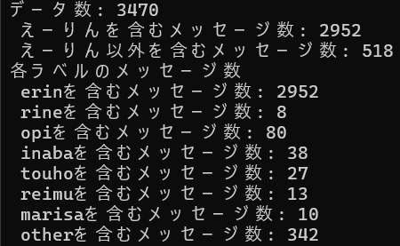
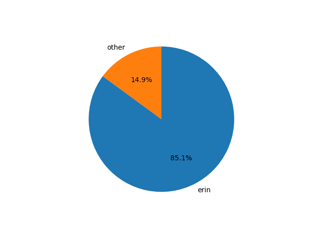
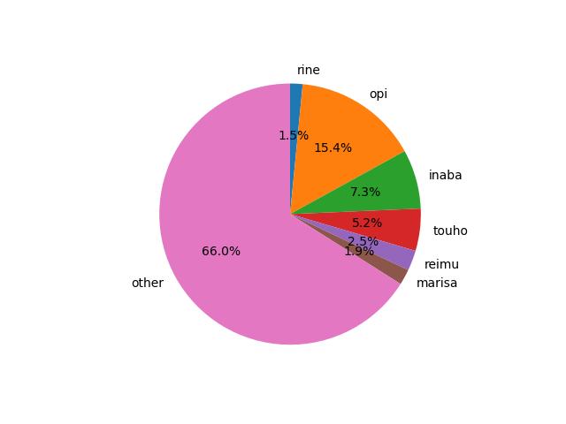
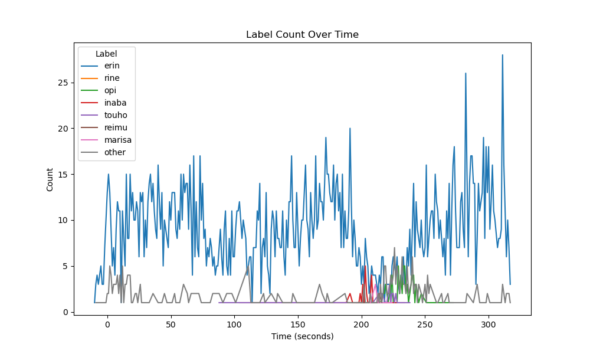

# ERINNN-comments

[Help me, ERINNNNNN!!](https://www.youtube.com/watch?v=X8z23t428kU)の動画に付けられたチャットを解析するために使用したコードです。

# 実行結果

- 各コメントの件数

  

- 全体に占める「えーりん」のコメントの割合

  

- えーりん以外のコメントの割合

  

- 時間ごとのコメント数の変化

  
